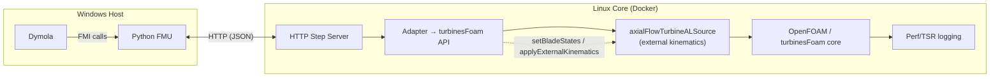

```mermaid
flowchart LR
  subgraph WIN[Windows Host]
    DYM[Dymola]
    FMU[Python FMU]
    DYM -->|FMI calls| FMU
  end

  subgraph LNX["Linux Core (Docker)"]
    API[HTTP Step Server]
    ADP[Adapter → turbinesFoam API]
    AL["axialFlowTurbineALSource<br/>(external kinematics)"]
    OF[OpenFOAM / turbinesFoam core]
    LOG[Perf/TSR logging]
    API --> ADP --> AL --> OF --> LOG
    ADP -.->|setBladeStates / applyExternalKinematics| AL
  end

  FMU <-->|"HTTP (JSON)"| API
```